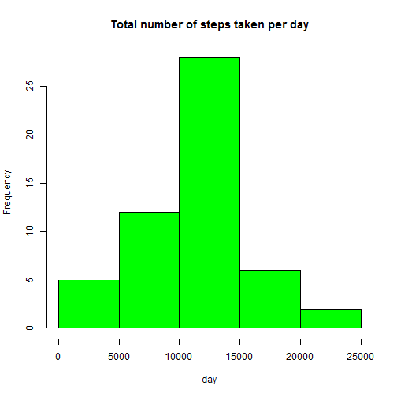
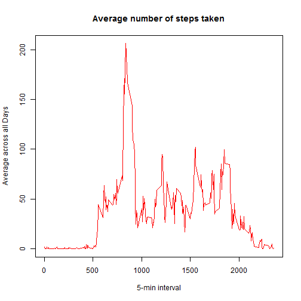
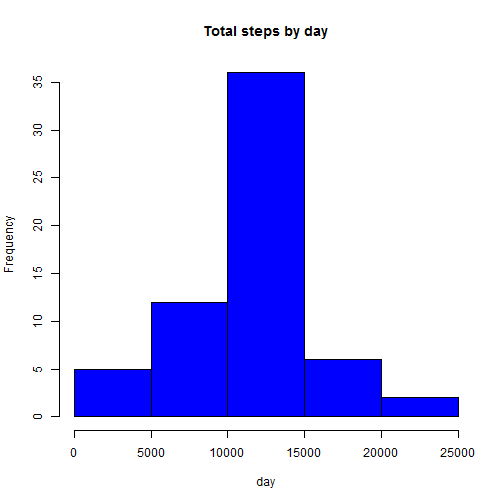

This is an R Markdown document. Markdown is a simple formatting syntax for authoring HTML, PDF, and MS Word documents. For more details on using R Markdown see <http://rmarkdown.rstudio.com>.

When you click the **Knit** button a document will be generated that includes both content as well as the output of any embedded R code chunks within the document. You can embed an R code chunk like this:


```r
summary(cars)
```

```
##      speed           dist       
##  Min.   : 4.0   Min.   :  2.00  
##  1st Qu.:12.0   1st Qu.: 26.00  
##  Median :15.0   Median : 36.00  
##  Mean   :15.4   Mean   : 42.98  
##  3rd Qu.:19.0   3rd Qu.: 56.00  
##  Max.   :25.0   Max.   :120.00
```

You can also embed plots, for example:

 

Note that the `echo = FALSE` parameter was added to the code chunk to prevent printing of the R code that generated the plot.

Reproducible Research: Peer Assessment 1
Loading and preprocessing the data


```r
activity <- read.csv("activity.csv", colClasses = c("numeric", "character", 
    "numeric"))
head(activity)
```

```
##   steps       date interval
## 1    NA 2012-10-01        0
## 2    NA 2012-10-01        5
## 3    NA 2012-10-01       10
## 4    NA 2012-10-01       15
## 5    NA 2012-10-01       20
## 6    NA 2012-10-01       25
```


```r
names(activity)
```

```
## [1] "steps"    "date"     "interval"
```


```r
library(lattice)
activity$date <- as.Date(activity$date, "%Y-%m-%d")
```

1. What is mean total number of steps taken per day? Calculate the total number of steps taken per day

```r
StepsTotal <- aggregate(steps ~ date, data = activity, sum, na.rm = TRUE)
hist(StepsTotal$steps, main = "Total number of steps taken per day", xlab = "day", col = "green")
```

 

Calculate and report the mean and median of the total number of steps taken per day

```r
mean(StepsTotal$steps)
```

```
## [1] 10766.19
```

```r
median(StepsTotal$steps)
```

```
## [1] 10765
```

2. What is the average daily activity pattern?
Make a time series plot (i.e. type = "l") of the 5-minute interval (x-axis) and the average number of steps taken, averaged across all days (y-axis)

```r
time_series <- tapply(activity$steps, activity$interval, mean, na.rm = TRUE)
plot(row.names(time_series), time_series, type = "l", xlab = "5-min interval", 
     ylab = "Average across all Days", main = "Average number of steps taken", 
     col = "red")
```

 
Which 5-minute interval, on average across all the days in the dataset, contains the maximum number of steps?

```r
max_interval <- which.max(time_series)
names(max_interval)
```

```
## [1] "835"
```

3. Imputing missing values
Calculate and report the total number of missing values in the dataset (i.e. the total number of rows with NAs)

```r
activity_NA <- sum(is.na(activity))
activity_NA
```

```
## [1] 2304
```

Devise a strategy for filling in all of the missing values in the dataset
Create a new dataset that is equal to the original dataset but with the missing data filled in


```r
StepsAverage <- aggregate(steps ~ interval, data = activity, FUN = mean)
fillNA <- numeric()
for (i in 1:nrow(activity)) {
  obs <- activity[i, ]
  if (is.na(obs$steps)) {
    steps <- subset(StepsAverage, interval == obs$interval)$steps
  } else {
    steps <- obs$steps
  }
  fillNA <- c(fillNA, steps)
}
```

Make a histogram of the total number of steps taken each day and Calculate and report the mean and median total number of steps taken per day

```r
new_activity <- activity
new_activity$steps <- fillNA
StepsTotal2 <- aggregate(steps ~ date, data = new_activity, sum, na.rm = TRUE)
hist(StepsTotal2$steps, main = "Total steps by day", xlab = "day", col = "blue")
```

 


```r
mean(StepsTotal2$steps)
```

```
## [1] 10766.19
```

```r
median(StepsTotal2$steps)
```

```
## [1] 10766.19
```
The mean stays the same but the median is close to the previous one

4- Are there differences in activity patterns between weekdays and weekends?

Create a new factor variable in the dataset with two levels - "weekday" and "weekend" indicating whether a given date is a weekday or weekend day


```r
day <- weekdays(activity$date)
daylevel <- vector()
for (i in 1:nrow(activity)) {
  if (day[i] == "Saturday") {
    daylevel[i] <- "Weekend"
  } else if (day[i] == "Sunday") {
    daylevel[i] <- "Weekend"
  } else {
    daylevel[i] <- "Weekday"
  }
}
```


```r
activity$daylevel <- daylevel
activity$daylevel <- factor(activity$daylevel)
```


```r
stepsByDay <- aggregate(steps ~ interval + daylevel, data = activity, mean)
names(stepsByDay) <- c("interval", "daylevel", "steps")
```

Make a panel plot containing a time series plot (i.e. type = "l") of the 5-minute interval (x-axis) and the average number of steps taken, averaged across all weekday days or weekend days (y-axis)


```r
xyplot(steps ~ interval | daylevel, stepsByDay, type = "l", layout = c(1, 2), 
       xlab = "Interval", ylab = "Number of steps")
```

 

